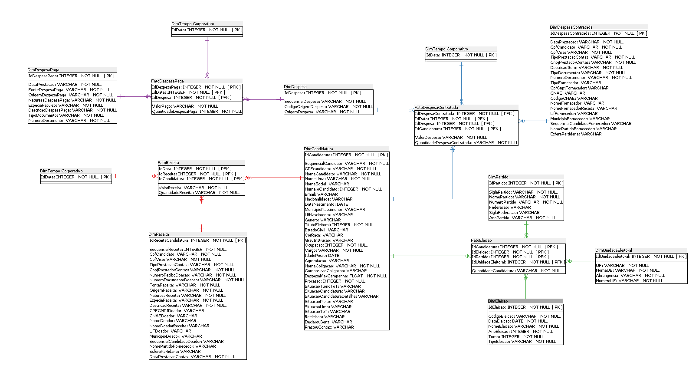

<html lang="pt">
<body>
<h1>Repositório para arquivos do meu trabalho de conclusão de cursos</h1>

Relatórios feitos utilizados Pandas Profiling

<a href="relatorio_candidatos_completo.html">Candidatos</a>
<a href="relatorio_despesas_contratadas_candidatos.html">Despesas Contratadas</a>
<a href="relatorio_despesas_pagas_candidatos.html">Despesas Pagas</a>
<a href="relatorio_receitas_candidatos.html">Receitas</a>

Imagens

<a href="imagens/modelo_dimensional.png">Modelo Dimensional</a>

Autorizo o uso livre dos arquivos hospedados aqui, desde que propriamente creditado

</body>
</html>
